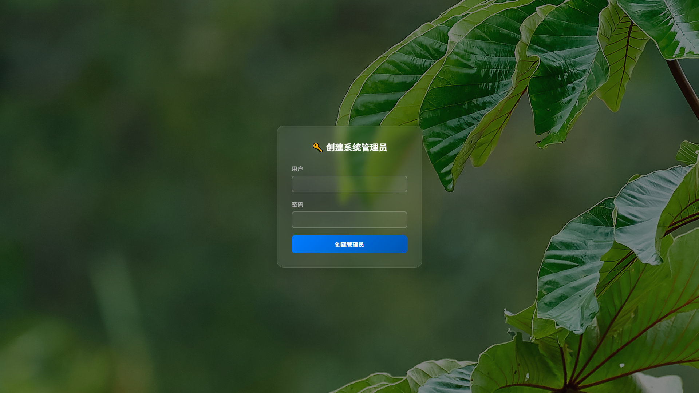
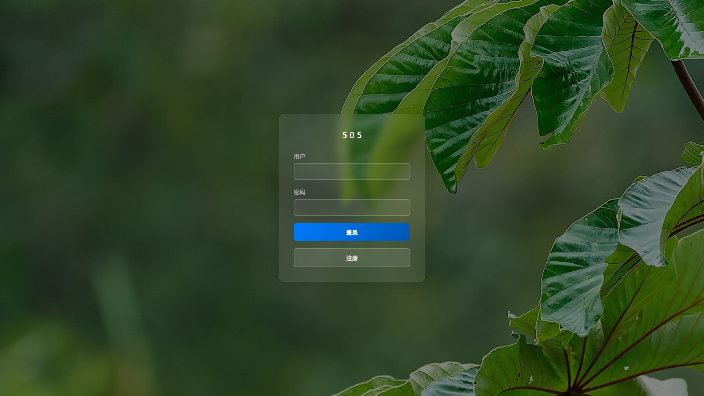
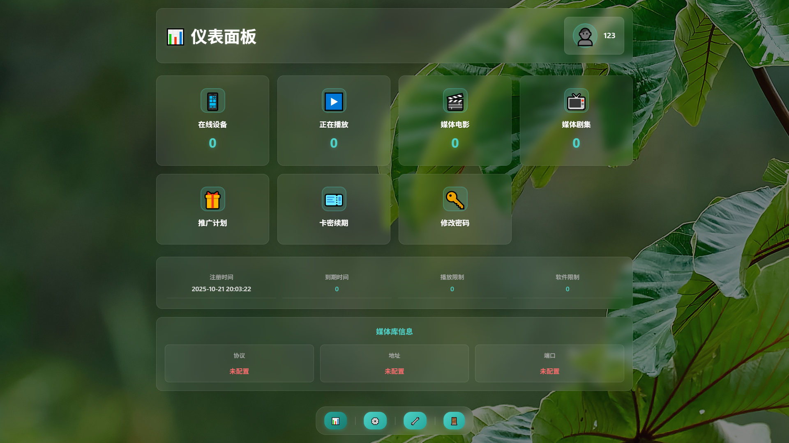
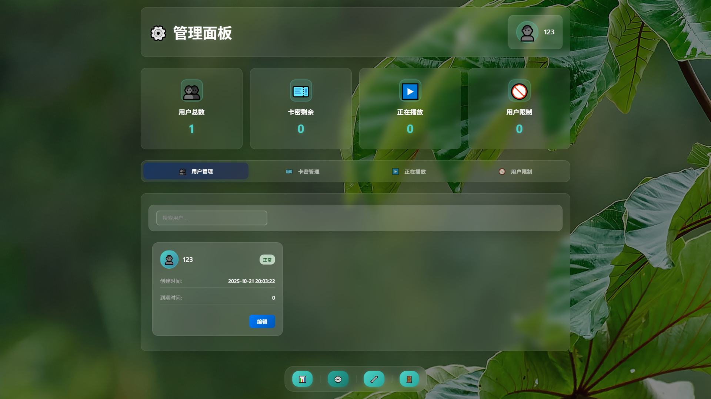
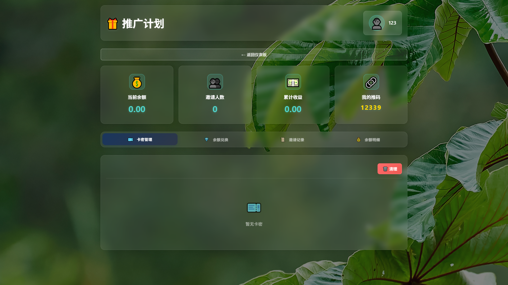
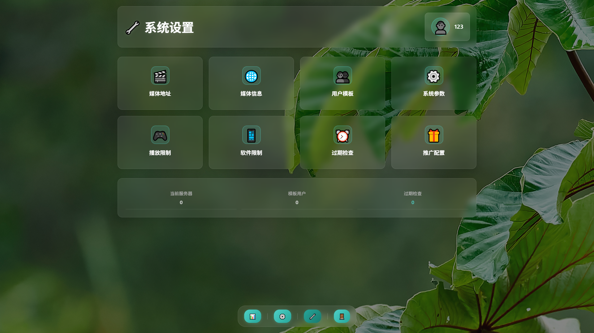

# UserTools - 用户管理系统

<div align="center">


**一个功能强大的用户管理和卡密系统**

</div>

---

## 📖 项目简介

UserTools 是一个现代化的 Emby 用户管理系统，提供完整的用户生命周期管理、卡密系统、推广计划等功能。采用前后端分离架构，提供优雅的 Web 界面和 RESTful API。

### 🎯 适用场景

- 💼 会员管理系统
- 🎫 卡密销售平台
- 👥 用户订阅服务
- 📊 数据统计分析
- 🎁 推广返利系统

---

## ✨ 核心功能

### 🔐 用户管理
- ✅ 用户注册与登录
- ✅ JWT 令牌认证
- ✅ 权限管理（管理员/普通用户）
- ✅ 用户信息管理
- ✅ 批量操作支持

### 🎫 卡密系统
- ✅ 批量生成卡密
- ✅ 卡密兑换与续费
- ✅ 使用记录追踪
- ✅ 一键清理已用卡密

### 📊 数据统计
- ✅ 实时用户统计
- ✅ 卡密使用分析
- ✅ 收益数据展示
- ✅ 可视化仪表盘
- ✅ 系统状态监控

### 🎁 推广计划
- ✅ 邀请码生成
- ✅ 邀请奖励系统
- ✅ 积分兑换卡密
- ✅ 推广记录查询
- ✅ 收益统计

### 👨‍💼 管理员功能
- ✅ 用户管理与监控
- ✅ 系统配置管理
- ✅ 用户封禁/解封
- ✅ 设备管理
- ✅ 实时会话监控
- ✅ 操作日志记录

---

## 🎨 界面展示

### 现代化 UI 设计
- 📱 **响应式设计** - 完美适配PC、平板、手机
- 🌈 **美观界面** - 现代化设计风格
- ⚡ **流畅体验** - 快速响应，操作便捷
- 🎯 **直观操作** - 简洁易用的交互设计

### 主要页面
- 🏠 **仪表盘** - 数据总览与快速操作
- 👤 **用户管理** - 用户列表与详细信息
- 🎫 **卡密管理** - 生成、查询、管理卡密
- 📈 **数据统计** - 可视化图表展示
- 🎁 **推广中心** - 推广链接与收益查看
- ⚙️ **系统设置** - 个性化配置选项

### 📸 界面截图

<div align="center">

#### 首次部署 - 创建管理员


#### 登录页面


#### 仪表盘


#### 管理员面板


#### 推广中心


#### 系统设置


</div>

---

## 🚀 技术特点

- ⚡ **高性能架构** - 快速响应，支持高并发
- 🔒 **安全可靠** - 密码加密、JWT认证、SQL注入防护
- 📦 **轻量部署** - Docker容器化，一键部署
- 🗄️ **数据持久化** - SQLite数据库，稳定可靠
- 📝 **完整日志** - 操作记录，便于追踪
- 🔄 **优雅关闭** - 支持平滑重启和升级

---

## 💻 部署方式

Docker 容器化部署：

```bash
docker run -d --name usertools -p 505:505 \
  -v ./data:/data -v ./configs:/configs usertools:latest
```

**系统要求**: Linux/Windows/macOS • 512MB+ 内存 • 100MB 存储

---

## 📚 快速开始

1. 启动系统并访问 `http://your-server:505`
2. 首次访问创建管理员账号
3. 登录后即可使用所有功能

---

## 📊 数据统计

用户增长趋势 • 收益统计 • 卡密分析 • 在线监控 • 推广追踪

---

## 🛡️ 安全特性

密码加密 • JWT认证 • SQL防护 • CORS保护 • 操作审计 • XSS/CSRF防护

---

## 📋 版本信息

**当前版本**: v1.0.0

用户管理 • 卡密系统 • 推广计划 • 实时监控 • Docker 支持 • 响应式界面

---

## 💬 联系方式

- 📧 **邮箱**: luxdongzzz@gmail.com
- 👤 **GitHub**: [@Xieburouzzz](https://github.com/Xieburouzzz)

**合作咨询**: 源代码授权 • 定制开发 • 部署支持 • 技术培训

---

## ❓ 常见问题

**Q: 项目开源吗？**  
A: 本项目为闭源商业项目，如需授权请联系作者。

**Q: 支持哪些数据库？**  
A: SQLite 数据库，轻量易部署。

**Q: 可以定制开发吗？**  
A: 支持定制开发和功能扩展。

**Q: 如何获取使用权限？**  
A: 请通过邮箱 luxdongzzz@gmail.com 联系。

---

## 📄 许可证

Copyright © 2025 Xieburouzzz. All rights reserved.

---

<div align="center">

**Built with ❤️ by Xieburouzzz**

⭐ 如果您对本项目感兴趣，欢迎 Star 本仓库！

</div>

